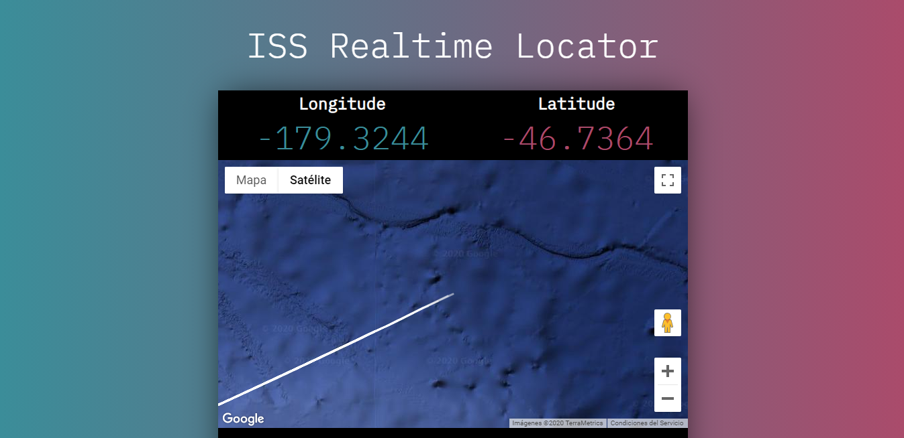

<h1 align="center">📡 ISS Realtime Locator ⚡</h1>

<p align="center">
  ISS Realtime locator with Google Maps API
</p>

<p align="center">
  
</p>

<p align="center">
  
  
  
  
  
  
</p>

## 🚀 Deployment
📦 Install the dependencies
```bash
npm install
```
🌙 Run `webpack-dev-server` with development mode
```bash
npx webpack-dev-server
```

👷 Build the website with Webpack to export in the `public` folder.

```bash
npm run build
```

## 🤲 Contributing
Do you would like to contribute? Do you want to be the author of a new feature? Awesome! please fork the repository and make changes as you like. [Pull requests](https://github.com/360macky/ISS-Realtime-Locator/pulls) are warmly welcome.


## 📃 License
Distributed under the MIT License.
See [`LICENSE`](./LICENSE) for more information.

